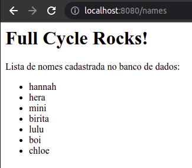

## Desafio Node

Nesse desafio você colocará em prática o que aprendemos em relação a utilização do nginx como proxy reverso. A idéia principal é que quando um usuário acesse o nginx, o mesmo fará uma chamada em nossa aplicação node.js. Essa aplicação por sua vez adicionará um registro em nosso banco de dados mysql, cadastrando um nome na tabela people.

O retorno da aplicação node.js para o nginx deverá ser:

```
</p>

<p>&lt;h1&gt;Full Cycle Rocks!&lt;/h1&gt;</p>

<p> 

</p>

<p>- Lista de nomes cadastrada no banco de dados.</p>

<p> 
```

Gere o docker-compose de uma forma que basta apenas rodarmos: docker-compose up -d que tudo deverá estar funcionando e disponível na porta: 8080.

Suba tudo em um repositório e faça a entrega.

* A linguagem de programação para este desafio é Node.


## Aplicação

A aplicação é composta por 2 rotas:

- (GET) /names: retorna um html com todos os nomes cadastrados na tabela de people do banco de dados

- (POST) /api/name: rota de api que recebe um nome e cadastra no banco de dados. O nome deve ser passado em formato json da seguinte maneira: '{"name":"qualquernome"}'

## Rodando

### Subindo aplicação

```
make run
```

### Inserindo dados

- via makefile

```
make insert-name name=qualquernome
```

- chamando curl diretamente

```
	curl -X POST http://localhost:8080/api/name -d '{"name": "qualquernome"}' -H "Content-type: application/json"
```

### Consultando nomes

Visite http://localhost:8080/names no navegador para visualizar os nomes cadastrados.
Ex:

